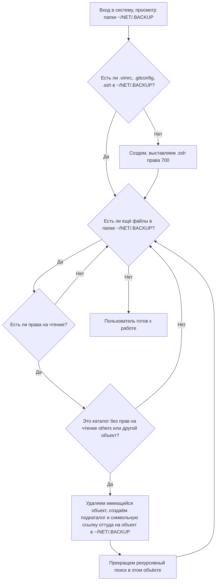

=== FEATURES/net-backup.service ===

# net-backup.service
Сервис создаёт символьные ссылки на содержимое каталога `$HOME/NET/.BACKUP` по следующим правилам:
* По умолчанию в `$HOME` создаётся всё дерево подкаталогов `$HOME/NET/.BACKUP`, а на другие объекты в них (файлы и т. д.) создаются символьные ссылки.
  * Например, если мы встретили файл `$HOME/NET/.BACKUP/путь/к/файлу`, создаётся каталог `$HOME/путь/к`, и заводится ссылка `$HOME/путь/к/файлу` → `$HOME/NET/.BACKUP/путь/к/файлу`.
* Предварительно в `$HOME/NET/.BACKUP` создаются подкаталоги `.ssh` и пустые файлы `.vimrc` и `.gitconfig`.
* Если мы встретили объект без прав на чтение, такая ссылка не заводится, а если это был каталог, его просмотр на этом заканчивается.
  * Например, это способ избежать автоматического создания `$HOME/.ssh`.
* Если мы встретили каталог без прав на чтение для others (`rwxr-x---`) — поступаем с ним как с файлом: создаётся ссылка, и просмотр каталога на этом заканчивается.
  * Это способ хранить в `$HOME/NET/.BACKUP` целые каталоги и заводить там новые файлы. Например, так устроен создаваемый автоматически `$HOME/.ssh` → `$HOME/NET/.BACKUP/.ssh`.
Таким образом, если нужно, чтобы файлы при следующем логине восстановились из `$HOME/NET/.BACKUP`, достаточно их туда скопировать. А если нужно, чтобы в `$HOME/NET/.BACKUP` лежал весь каталог, и новые файлы заводились сразу в нём, надо скопировать этот каталог и сделать ему `chmod o-r` .

# NETBACKUP

